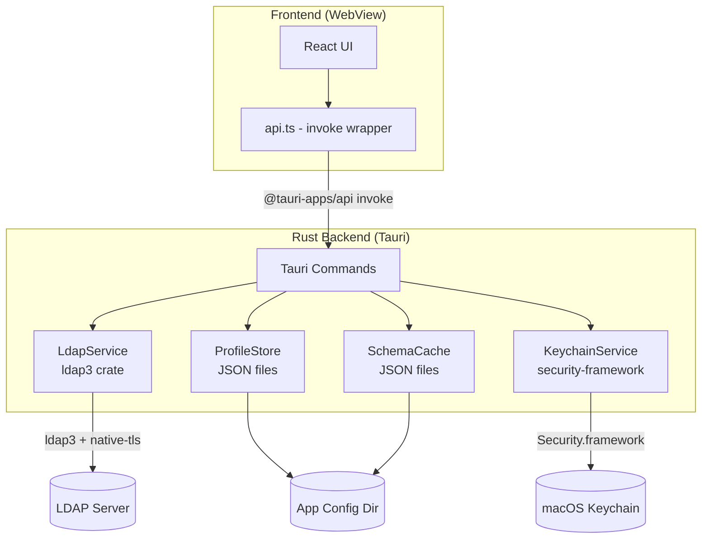

# RootNode

A native macOS LDAP browser and editor built with Tauri. Connect to Active Directory, OpenLDAP, or 389 Directory Server, browse the directory tree, search entries, and edit attributes — all from a clean, dark-mode-aware interface.

# WARNING: This has been 100% Vibecoded with Claude

It may can:
- break your Heart
- break your Bankaccount
- break your merriage
- break your Directory

Consider beeing warnded. I am at no Level an experianced Software Author and I don't know what I'm doing!

## Features

- Multi-server connections with saved profiles
- Simple bind and certificate (SASL EXTERNAL) authentication
- Password storage in macOS Keychain
- Tree-based directory browsing with breadcrumb navigation
- Click-to-browse into sub-OUs with infinite scroll pagination
- Search with configurable scope and base DN
- Attribute editing with schema-aware autocomplete
- Multi-value attribute support
- Grouped and sorted attribute display (Identity, Contact, Organization, Exchange, Security, Groups, System)
- Resizable panel layout
- Light and system (dark) theme support
- Server type detection (Active Directory / OpenLDAP / 389DS)
- Handles LDAP referrals and size-limited results gracefully

## Tech Stack

| Component | Version | Purpose |
| ----------- | --------- | --------- |
| Tauri | 2.x | Desktop shell (native webview + Rust backend) |
| Rust | stable | Backend: LDAP operations, keychain, persistence |
| ldap3 | 0.11.x | Rust LDAP client library |
| security-framework | 3.x | macOS Keychain access (no per-app ACL prompts) |
| React | 19.x | UI rendering |
| TypeScript | 5.x | Type safety |
| Vite | 6.x | Frontend bundler + dev server |
| CSS Modules | native | Scoped component styles (zero dependencies) |

## Prerequisites

- **macOS** 10.15+ (arm64 or x64)
- **Node.js** >= 20.x (LTS recommended)
- **Rust** >= 1.70 (install via [rustup](https://rustup.rs))

## Project Structure

```text
src/                  # React frontend (Vite-bundled)
  main.tsx            # Entry point
  api.ts             # Tauri invoke wrapper (window.api)
  App.tsx            # Root component and layout
  types.ts           # Shared TypeScript types
  components/        # UI components
  hooks/             # Custom React hooks
src-tauri/           # Rust backend
  src/
    main.rs          # Tauri app entry, command registration
    types.rs         # Shared Rust types (serde-compatible)
    helpers.rs       # AD timestamp, GUID, SID decoding
    commands/        # Tauri command handlers
      profiles.rs    # Profile CRUD
      ldap.rs        # LDAP connect/search/modify/create/delete
      keychain.rs    # Keychain set password
      schema.rs      # Schema get/clear/refresh
    services/        # Backend services
      ldap_service.rs    # LDAP connection and operations (ldap3)
      profile_store.rs   # JSON-based profile persistence
      schema_cache.rs    # Per-profile schema cache
      keychain.rs        # macOS Keychain via security-framework crate
  Cargo.toml         # Rust dependencies
  tauri.conf.json    # Tauri configuration
assets/              # App icon
```

## Architecture



### Command API

The frontend communicates with the Rust backend via Tauri's `invoke` system. Commands are exposed as `window.api.*`:

| Namespace | Commands |
| ----------- | ---------- |
| `profiles` | `list`, `save`, `delete`, `testConnection` |
| `ldap` | `connect`, `disconnect`, `isConnected`, `getDetectedBaseDn`, `getServerType`, `search`, `getEntry`, `modifyEntry`, `createEntry`, `deleteEntry` |
| `keychain` | `setPassword` |
| `schema` | `get`, `clear`, `refresh` |

## Development

### Install dependencies

```bash
npm install
```

### Run in development mode

```bash
npx tauri dev
```

This starts the Vite dev server (page reload on frontend changes) and compiles + launches the Rust backend. Frontend changes trigger a page reload; Rust changes trigger a recompile.

For frontend-only iteration (no Tauri shell):

```bash
npm run dev
```

### Build the Rust backend only

```bash
cd src-tauri && cargo check
```

## Building a Release Package

### Build the DMG

```bash
npx tauri build
```

This runs the full pipeline:

1. Bundles the frontend with Vite (`dist/`)
2. Compiles the Rust backend in release mode
3. Packages into a macOS `.app` bundle and `.dmg`

The output is placed in `src-tauri/target/release/bundle/`:

```text
src-tauri/target/release/bundle/macos/RootNode.app
src-tauri/target/release/bundle/dmg/RootNode_<version>_aarch64.dmg
```

### Code signing and notarization

The default build uses ad-hoc signing (no Apple Developer certificate). For distribution outside your machine:

1. Set up an Apple Developer ID certificate
2. Configure environment variables:

   ```bash
   export APPLE_SIGNING_IDENTITY="Developer ID Application: Your Name (TEAM_ID)"
   export APPLE_ID="your@apple.id"
   export APPLE_PASSWORD="app-specific-password"
   export APPLE_TEAM_ID="TEAM_ID"
   ```

3. Tauri will automatically sign and notarize when these are set.

## Cross-Platform (Future)

The project is structured for cross-platform extension:

- Add `"nsis"` (Windows) and `"deb"` (Linux) to `bundle.targets` in `tauri.conf.json`
- Keychain service uses `security-framework` (macOS); will need platform-specific implementations for Windows (DPAPI) and Linux (Secret Service)
- `native-tls` uses platform-appropriate TLS on each OS
- LDAP logic and UI are fully platform-agnostic

## Keeping Dependencies Up to Date

### Check for outdated packages

```bash
npm outdated
cd src-tauri && cargo outdated  # requires cargo-outdated
```

### Priority update targets

| Package | Why | Frequency |
| --------- | ----- | ----------- |
| `tauri` | Security patches for webview integration | Every minor release |
| `ldap3` | Network-facing LDAP client | On any security advisory |
| `native-tls` | TLS security | On advisory |
| `vite` | Dev server + bundler | Quarterly or on advisory |
| Rust toolchain | Compiler improvements + security | Quarterly |

### Audit for known vulnerabilities

```bash
npm audit
cd src-tauri && cargo audit  # requires cargo-audit
```

## Configuration Storage

| Data | Location |
| ------ | ---------- |
| Connection profiles | `~/Library/Application Support/com.rootnode.app/rootnode/profiles.json` |
| Schema cache | `~/Library/Application Support/com.rootnode.app/rootnode/schema-cache/` |
| Passwords | macOS Keychain (service: `rootnode`) |

## License

ISC
